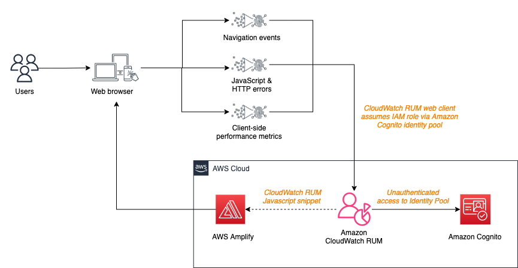
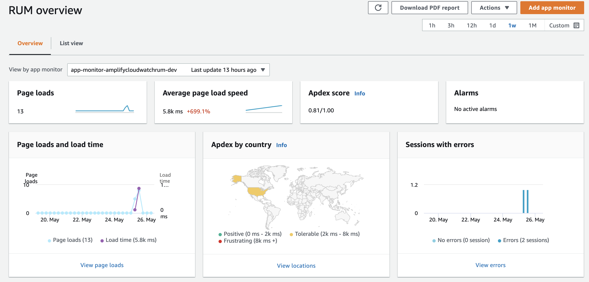
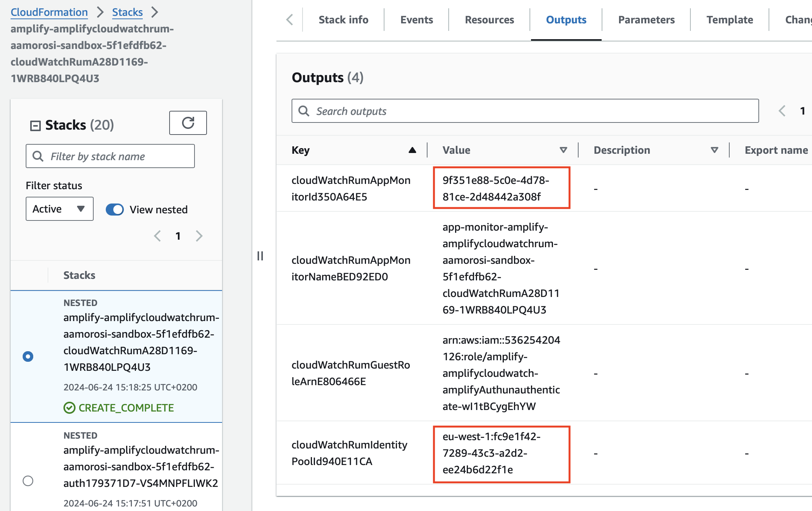
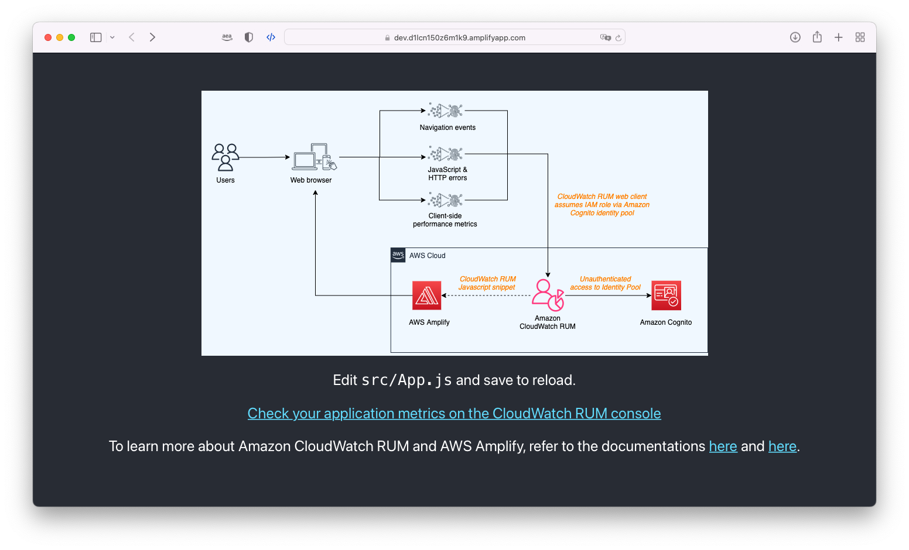

# AWS Real User Monitoring (RUM) for Amplify Apps

When you launch a web application to users globally, you want to be able to monitor the experience of your end users as they interact with the application. The end users can be accessing the application with different browsers, geographic locations, connectivity and so forth which can lead to varied user experiences.

During re:Invent 2021, AWS announced [Amazon CloudWatch Real-User Monitoring](https://aws.amazon.com/blogs/aws/cloudwatch-rum/) (RUM) for web applications. The CloudWatch RUM service enables you to collect, view, and analyze client-side data about your web application performance from actual user sessions in near real time. Application Developers and DevOps engineers can use this data to quickly identify and debug client-side issues to optimize end user experience. To get started, you simply generate a JavaScript snippet for your application by creating a RUM app monitor. This snippet is added to the header section in the HTML of your application. As users interact with your application, the RUM web client will collect and send data about the session to CloudWatch RUM for visualization and analysis.

> [!Note]
> This sample was originally published on the AWS Front-End Web & Mobile blog in the post [Implementing Real User Monitoring of Amplify Application using Amazon CloudWatch RUM](https://aws.amazon.com/blogs/mobile/implementing-real-user-monitoring-of-amplify-application-using-amazon-cloudwatch-rum/). The original version used the AWS Amplify CLI to create the custom resource. The current version uses Amplify Gen 2 instead.

In this sample, we'll demonstrate how to integrate AWS Amplify Gen 2 with Amazon CloudWatch RUM. We'll instrument a simple React application with the CloudWatch RUM JavaScript snippet and create a custom resource in Amplify using AWS CDK (Cloud Development Kit) to configure the CloudWatch RUM service. The custom resource will create the necessary resources in AWS to enable the CloudWatch RUM service for the application.



Once you have completed the setup, you will be able to monitor the performance of your application in near real-time using the CloudWatch RUM console in the AWS Management Console.



## Deploy the sample

To deploy the sample, you need to have Node.js 18.x or newer installed on your machine, as well as having an AWS account.

Clone the repository and navigate to the `aws-real-user-monitory-amplifyapps` directory:

```sh
git clone https://github.com/aws-samples/aws-real-user-monitoring-amplifyapps.git
cd aws-amplify-stepfunctions-example
```

Install the dependencies:

```sh
npm ci
```

Replace the `domain` field with your domain in the `amplify/backend.ts` file if you are deploying the application instead of running it locally:

```ts
import { defineBackend } from "@aws-amplify/backend";
import { auth } from "./auth/resource";
import { CloudwatchRum } from "./custom/cfn-custom-cw-rum/resource";

/**
 * @see https://docs.amplify.aws/react/build-a-backend/ to add storage, functions, and more
 */
const backend = defineBackend({
  auth,
});

new CloudwatchRum(backend.createStack("cloudWatchRum"), "cloudWatchRum", {
  guestRole: backend.auth.resources.unauthenticatedUserIamRole,
  identityPoolId: backend.auth.resources.cfnResources.cfnIdentityPool.attrId,
  domain: "localhost", // Replace with your domain as needed
});
```

Deploy the sample:

```sh
npx ampx sandbox
```

After the deployment is complete, you will need to get the **CloudWatch RUM AppMonitor ID** and the **Amazon Cognito Identity Pool ID** from the AWS Management Console. Go to the CloudFormation console, select the stack that was created by the deployment (it should have `cloudWatchRum` in the name), and go to the `Outputs` tab. You will see the `AppMonitorId` value there



Open the `index.html` file and add the following JavaScript snippet to the header of the HTML of your application, replacing the placeholders with the values you got from the CloudFormation stack:

> [!Important]
> Make sure to replace the placeholders with the actual values from the CloudFormation stack as well as the AWS Region you are deploying the application to.

```diff
<head>
  <meta charset="utf-8" />
  <meta name="viewport" content="width=device-width, initial-scale=1" />
  <meta name="theme-color" content="#000000" />
  <meta name="description" content="Amazon CloudWatch RUM x AWS Amplify" />
  <title>Amazon CloudWatch RUM x AWS Amplify</title>
  <script>
    if (global === undefined) {
      var global = window;
    }
  </script>
  <!-- Insert CloudWatch RUM script tag here -->
+  <script>
+    (function (n, i, v, r, s, c, u, x, z) { x = window.AwsRumClient = { q: [], n: n, i: i, v: v, r: r, c: c, u: u }; window[n] = function (c, p) { x.q.push({ c: c, p: p }); }; z = document.createElement('script'); z.async = true; z.src = s; document.head.insertBefore(z, document.getElementsByTagName('script')[0]); })(
+      'cwr',
+      '[app-monitor-id]',
+      '1.0.0',
+      '[aws-region]',
+      'https://client.rum.us-east-1.amazonaws.com/1.18.0/cwr.js',
+      {
+        sessionSampleRate: 1,
+        identityPoolId: '[identity-pool-id]',
+        endpoint: 'https://dataplane.rum.[aws-region].amazonaws.com',
+        telemetries: ["performance", "errors", "http"],
+        allowCookies: true,
+        enableXRay: true
+      });
+  </script>

</head>
```

After adding the JavaScript snippet, you can start the application by running the following command:

```sh
npm run dev
```

If everything went well, you should see in the terminal the url of your Amplify Hosting application. When visiting it you should see the application load successfully.



After reloading the page a few times, go check out the CloudWatch RUM console in the AWS Management Console and see if you see any new telemetry data.

## Security

See [CONTRIBUTING](CONTRIBUTING.md#security-issue-notifications) for more information.

## License

This library is licensed under the MIT-0 License. See the LICENSE file.
