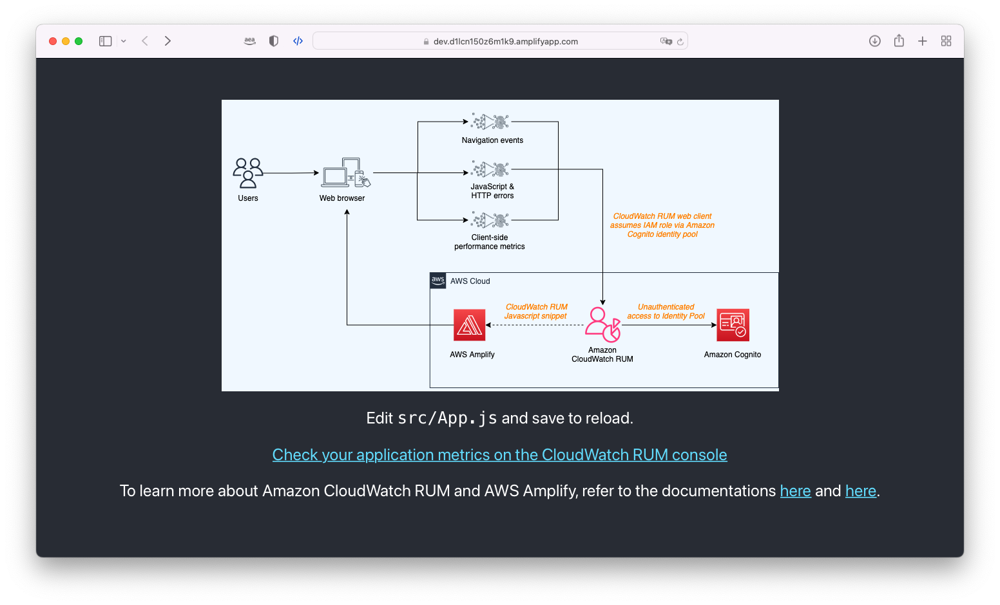

## AWS Real User Monitoring (RUM) for Amplify Apps

When you launch a web application to users globally, you want to be able to monitor the experience of your end users as they interact with the application. The end users can be accessing the application with different browsers, geographic locations, connectivity and so forth which can lead to varied user experiences.

During re:invent 2021, AWS announced [Amazon CloudWatch Real-User Monitoring](https://aws.amazon.com/blogs/aws/cloudwatch-rum/) (RUM) for web applications. The CloudWatch RUM service enables you to collect, view, and analyze client-side data about your web application performance from actual user sessions in near real time. Application Developers and DevOps engineers can use this data to quickly identify and debug client-side issues to optimize end user experience. To get started, you simply generate a JavaScript snippet for your application by creating a RUM app monitor. This snippet is added to the header section in the HTML of your application. As users interact with your application, the RUM web client will collect and send data about the session to CloudWatch RUM for visualization and analysis.

<!-- This repository accompanies a blog post that details how to implement Real User Monitoring of Amplify Application using CloudWatch RUM, [read the full post here on the AWS Blog](ADD BLOG POST LINK HERE)! -->


## Setup

You can choose to try the setup described in the repository and blog post by either using the provided sample code or by creating your own React app from scratch.

### Prerequisites

- An [AWS Account](https://aws.amazon.com/) which you can use as the target to deploy the Amplify Application
- Node.js version 16.x or higher and npm version 8.x or higher
- Amplify CLI (`npm i -g @aws-amplify/cli@latest`) - which can be setup following the [instructions here](https://docs.amplify.aws/cli/)
- A terminal and IDE from your local computer or any a cloud based environment like Cloud9
- (Optional) If using Cloud9 consider resizing the EBS Volume to allow enough space for the project

## Use the provided sample app

### Step 1: Install the application's dependencies

As a first step, open a new terminal window in the project's root after cloning the repo, and then run the following command to install the application's dependencies:

```sh
npm i
```

### Step 2: Initialize Amplify app

Next, while still in the project's root directory, run the following command to initialize the Amplify app:

```sh
amplify init
```

### Step 3: Update the configuration files

Some of the Amplify-managed resources need to be configured to work with your AWS Account and Region. Before starting to edit the configuration files, make sure to obtain your AWS Account ID and the AWS Region name that you want to use. You can retrieve these values from the [AWS Management Console](https://docs.aws.amazon.com/IAM/latest/UserGuide/console_account-alias.html). Alternatively, you can also run `aws sts get-caller-identity` and retrieve the Account ID using the AWS CLI.

In addition to the values you just retrieved you also need to use the name of the Amplify project and environment that you specified when you initialized the Amplify app in the previous step.

Once you have the two values, start by opening the `amplify/backend/awscloudformation/override.ts` file using your favorite text editor and replace both instances of the placeholder values (example shown below) with your own values.

For example, this:

```ts
// Replace AWS Region and Account ID (https://docs.aws.amazon.com/IAM/latest/UserGuide/console_account-alias.html)
// of your Amplify project, as well as the correct project’s name and environment.
Resource: "arn:aws:rum:[aws-region]:[aws-account-id]:appmonitor/app-monitor-[amplify-project-name]-[amplify-env]",
```

Would become this:

```ts
// Replace AWS Region and Account ID (https://docs.aws.amazon.com/IAM/latest/UserGuide/console_account-alias.html)
// of your Amplify project, as well as the correct project’s name and environment.
Resource: "arn:aws:rum:eu-west-1:123456789012:appmonitor/app-monitor-awsrealusermonitor-dev",
```

Next, open the `amplify/backend/function/cfncustomfn/custom-policies.json` file and replace repeat the same steps as above for the Resource ARN value. In this specific instance you can skip the `${env}` value as Amplify CLI will take care of interpolate it for us.

```json
"arn:aws:rum:[aws-region]:[aws-account-id]:appmonitor/app-monitor-[amplify-project-name]-${env}"
```

### Step 4: Deploy the AWS resources

Now that you have configured the Amplify app, you can deploy the AWS resources by running the following command:

```sh
amplify publish
```

> Note
> In the command above we are using `publish` instead of `push` because we want to make sure that the Amplify app is properly deployed to Amplify Hosting and an URL is generated.

### Step 5: Set the Amplify Hosting URL as domain for CloudWatch RUM

As output of the previous step, you should have a new URL that you can use to access your Amplify app. This URL will be used by the CloudWatch RUM service to collect data about your application. We need to update the CDK template for the CloudWatch RUM resources to use this URL.

Open the `amplify/backend/custom/cloudwatchrum/cdk-stack.ts` file and find the line that looks like the one below, then replace the value with the one that was generated in the previous step.

```ts
domain: "dev.xXxxXXxxxxxxxx.amplifyapp.com",
```

Then run `amplify push -y` once again to deploy the resources.

### Step 6: Add the CloudWatch RUM JavaScript snippet to your application

After running the previous command the `post-push.js` script present in the `amplify/hooks/` folder should have been run. This script retrieves all the configurations that were generated by the Amplify CLI and then outputs them in the console so that you can copy and add them to the JavaScript snippet to the header of the HTML of the application.

Below an example of the output you should see in the terminal:

```sh
----- 🪝 post-push execution start -----
Copy/paste these values in public/index.html with CloudWatch RUM code snippet below
appMonitorId 36663679-cbb1-4a91-afc1-e25517517f8e
appMonitorGuestRoleArn arn:aws:iam::123456789101:role/amplify-amplifycloudwatchrum-unauthRole
appMonitoridentityPoolId eu-west-1:3c57c6f1-7f27-44c2-ad46-99636a4cb218
awsRegion eu-west-1
----- 🪝 post-push execution end -----
```

Open the `public/index.html` file and add the following JavaScript snippet to the header of the HTML of your application:

```html
<script>
  (function (n, i, v, r, s, c, x, z) {
    x = window.AwsRumClient = { q: [], n: n, i: i, v: v, r: r, c: c };
    window[n] = function (c, p) {
      x.q.push({ c: c, p: p });
    };
    z = document.createElement("script");
    z.async = true;
    z.src = s;
    document.head.insertBefore(
      z,
      document.head.getElementsByTagName("script")[0]
    );
  })(
    "cwr",
    "[appMonitorId]", // Replace this with appMonitorId
    "1.0.0",
    "[awsRegion]", // Replace this with awsRegion
    "https://client.rum.us-east-1.amazonaws.com/1.2.1/cwr.js",
    {
      sessionSampleRate: 1,
      guestRoleArn: "[appMonitorGuestRoleArn]", // Replace this with appMonitorGuestRoleArn
      identityPoolId: "[appMonitoridentityPoolId]", // Replace this with appMonitoridentityPoolId
      endpoint: "https://dataplane.rum.[awsRegion].amazonaws.com", // Replace this with awsRegion
      telemetries: ["performance", "errors", "http"],
      allowCookies: true,
      enableXRay: true,
    }
  );
</script>
```

While you are at it, make sure to replace all the placeholder values with the values that were generated by the Amplify CLI.

### Step 7: Deploy the React app to Amplify Hosting

Now that all the pieces are in place, run the following command to deploy the application to Amplify Hosting:

```sh
amplify publish -y
```

If everything went well, you should see in the terminal the url of your Amplify Hosting application. When visiting it you should see the application load successfully.



After reloading the page a few times, go check out the CloudWatch RUM console in the AWS Management Console and see if you see any new telemetry data.


## Create your own app

If you want to create your own app, please follow the steps described in [the blog post](https://aws.amazon.com/blogs/mobile/implementing-real-user-monitoring-of-amplify-application-using-amazon-cloudwatch-rum/).

## Additional resources

In case you want to avoid having to copy and paste the JavaScript snippet and the values (Step 6), you can use the alternative `post-push.js` hook found in the `amplify/hooks/` folder. This file will be run after each `amplify push` command and will **overwrite** the content of the `public/index.html` file with the values that were generated by the Amplify CLI.

## Security

See [CONTRIBUTING](CONTRIBUTING.md#security-issue-notifications) for more information.

## License

This library is licensed under the MIT-0 License. See the LICENSE file.
